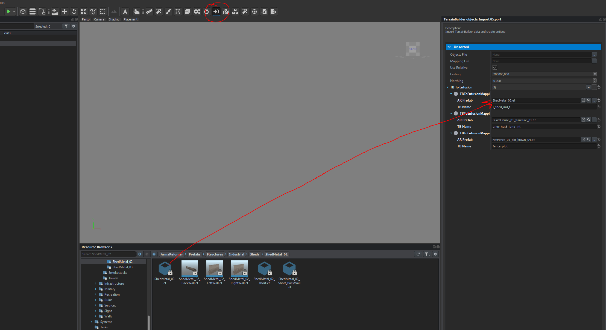

# Th3_TerrainBuilderUtils
This tool allows you to import your Terrain Builder object files (.txt) into Enfusion with the help of an integrated mapping table you will have to map objects from TB to Enfusions prefabs.

Using the same mapping table you can also export from Enfusion to Terrain Builder format.

Those mapping tables can also be exportet to file and imported again.

WARNING
This tool in its very early stage, to be sure not to break or loose your current progress make a copy of your map or create sub scene and test it there first.

## Installation
You can just launch the game and download it from the Workshop and add it as a dependency to your project. 

Here is the GUID to add it to existing projects (you need to download first) 
```
GUID
5968EDE2531518AF
```

# Usage
1. Download the mod from workshop and add it as dependency
2. Open World Editor and look for the following tool icon




3. Add your `objectx.txt` file to the Workbench project so it can be selected from the file chooser.
4. Adjust the parameters to your map
5. Create mappings for your objects - click on the + next to `TB To Enfusion`
    - AR Prfeb - choose a prefeb to replace a TB object
    - TB Name - this is the name of your object from the Terrain Builder Template Library
6. Export your mapping file to be used later aswell
    - You can later import the mappings again
7. Import your objects 
    - Objects will be imported into current active layer 


